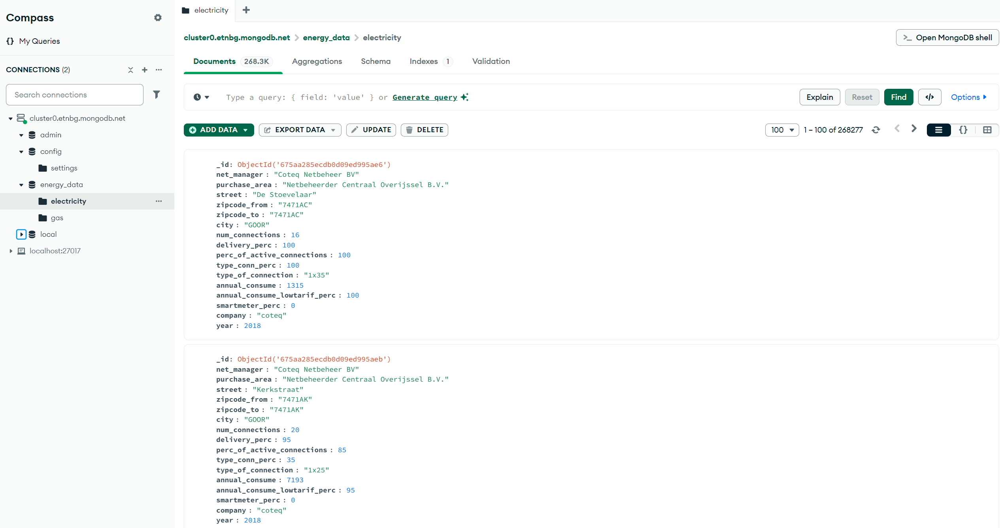
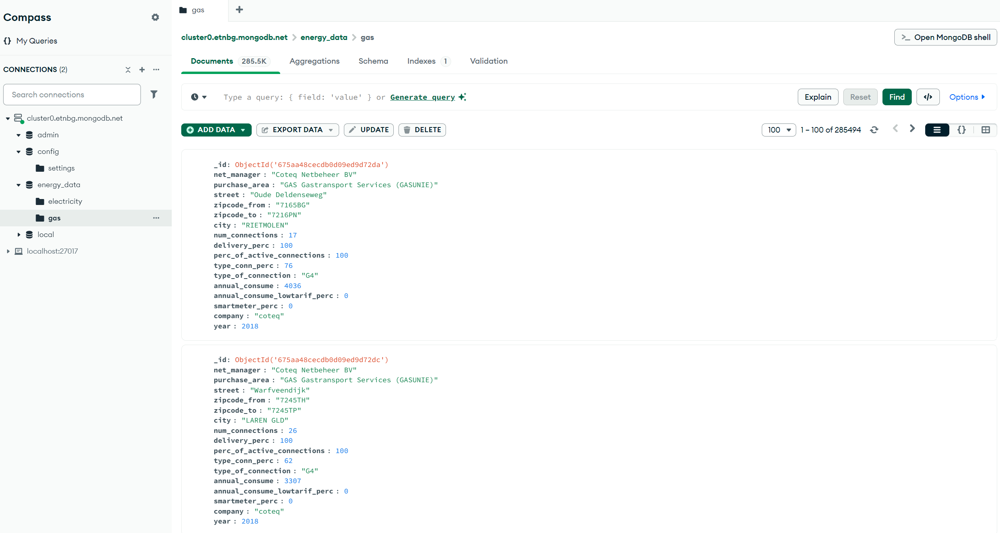

# EEET2574 - Assignment 2: MongoDB and Spark

**Student Name**: Nguyen Dang Huan - s3927467

---

## Table of Contentts

```
.
├── data/
├── EEET2574_Assignment2_data/
│   ├── Electricity/
│   │   ├── coteq_electricity_2018.csv
│   │   ├── coteq_electricity_2019.csv
│   │   ├── coteq_electricity_2020.csv
│   │   ├── stedin_electricity_2018.csv
│   │   ├── stedin_electricity_2019.csv
│   │   ├── stedin_electricity_2020.csv
│   │   ├── westland-infra_electricity_2018.csv
│   │   ├── westland-infra_electricity_2019.csv
│   │   └── westland-infra_electricity_2020.csv
│   └── Gas/
│       ├── coteq_gas_2018.csv
│       ├── coteq_gas_2019.csv
│       ├── coteq_gas_2020.csv
│       ├── stedin_gas_2018.csv
│       ├── stedin_gas_2019.csv
│       ├── stedin_gas_2020.csv
│       ├── westland-infra_gas_2018.csv
│       ├── westland-infra_gas_2019.csv
│       └── westland-infra_gas_2020.csv
├── images/
│   ├── electricity_collection.png
│   ├── gas_collection.png
│   ├── electricity_mlflow.png
│   ├── gas_mlflow.png
├── asm2_electricity.ipynb
├── asm2_gas.ipynb
├── README.md
├── s3927467.dbc
└── upload_data.py
```
1. `data/`: Folder contains the data files including cleaning and transforming data for traning and testing purpose.
2. `EEET2574_Assignment2_data/`: Folder contains the data files for the assignment.
3. `images/`: Folder contains the images for the assignment.
4. `asm2_electricity.ipynb`: Jupyter notebook for the electricity dataset.
5. `asm2_gas.ipynb`: Jupyter notebook for the gas dataset.
6. `s3927467.dbc`: Databricks file contains 2 notebooks for the electricity and gas datasets.
7. `upload_data.py`: Python script to upload data to MongoDB.

## Insructions
**Note**: The assignment questions are answered in the `asm2_gas.ipynb` notebook.

The `s3927467.dbc` file can be extracted to **Databricks** and contains 2 notebooks: `asm2_electricity` and `asm2_gas` for the electricity and gas datasets respectively.

### MongoDB
To upload the data to MongoDB, go to the script `upload_data`, replace your **MongoDB Cluster** path and run the following command:
```bash
python ./upload_data.py
```
or 
```bash
python3 ./upload_data.py
```

### MongoDB Collections
#### 1.Electricity Collection


#### 2.Gas Collection

